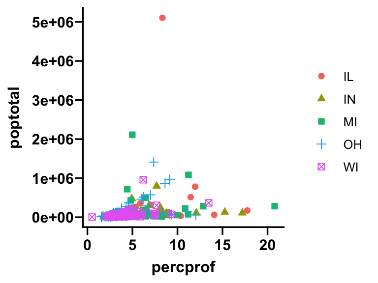
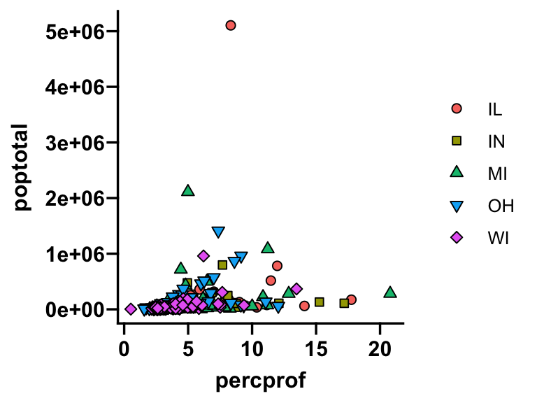
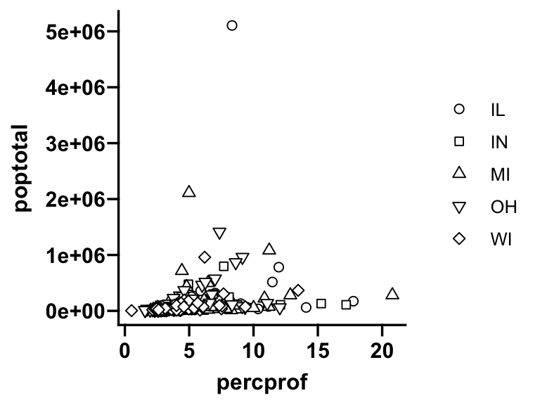
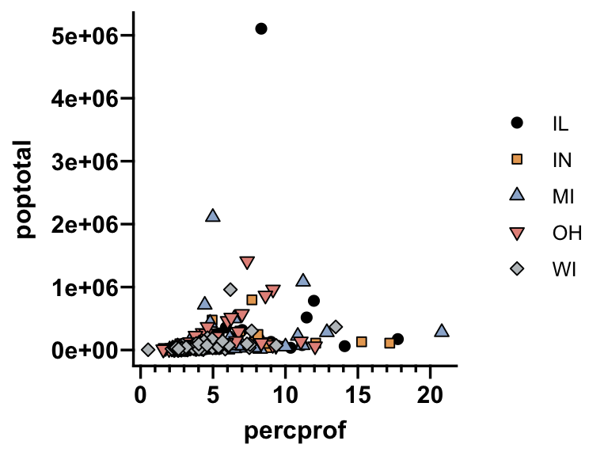

ggprism
================

<!-- README.md is generated from README.Rmd. Please edit that file -->

Prism colour schemes as ggplot2 themes.

This R package is a work in progress and is currently undocumented and
untested.

## Functions

``` r
# base ggplot2
library(ggplot2)
library(ggprism)
p <- ggplot(midwest, aes(x=percprof, y=poptotal)) +
  geom_point(aes(shape = state, fill = state, colour = state), size = 2)
p
```


### `theme_prism`

``` r
p <- p + theme_prism("black_and_white")
p
```



### `scale_shape_prism`

``` r
p <- p + scale_shape_prism("filled")
p
```



### `scale_fill_prism`

``` r
p <- p + scale_fill_prism("prism_light")
p
```



### `scale_colour_prism`

``` r
# also can use scale_color_prism
p <- p + scale_colour_prism("prism_light") 
p
```


### `guide_prism_minor`

``` r
p <- p + scale_x_continuous(minor_breaks = seq(0, 20, 1), 
                            guide = "prism_minor") + 
  scale_y_continuous(minor_breaks = seq(0, 5e6, 0.5e6), 
                     guide = "prism_minor") + 
  coord_cartesian(xlim = c(0, 20))
p
```


