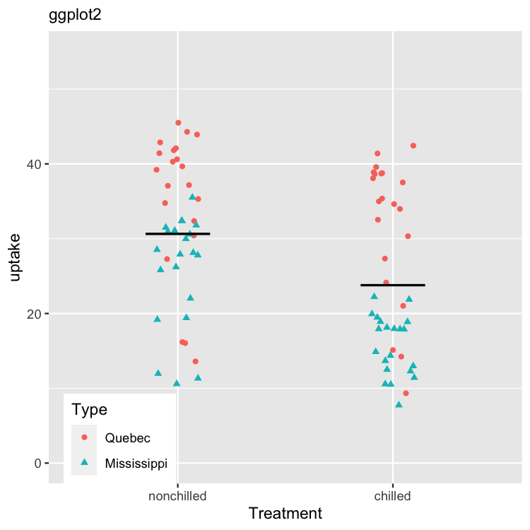
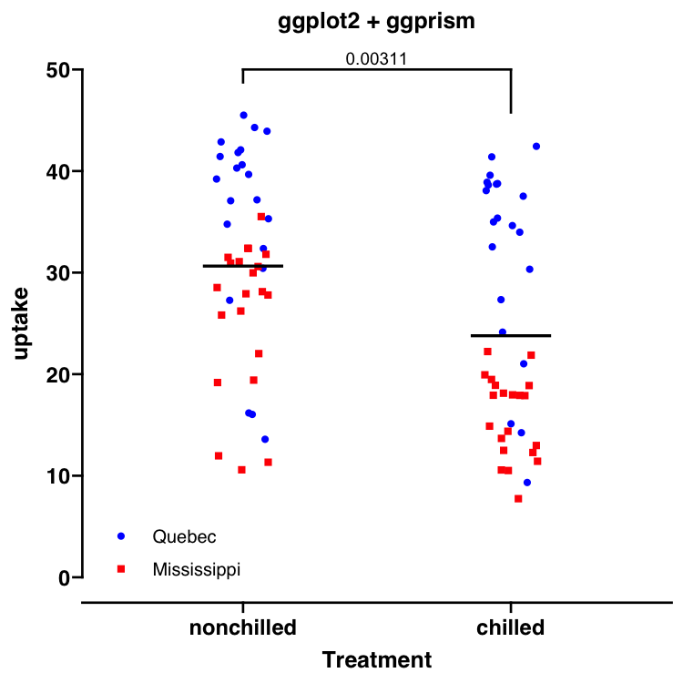

ggprism
================

<!-- README.md is generated from README.Rmd. Please edit that file -->

The `ggprism` package provides various themes, palettes, and other
useful functions to customise ggplots and give them the ‘GraphPad Prism’
look.

This package is currently still in development. It is fully functional
but usage examples and vignettes have not yet been written.

## Install

Install the development version from github.

``` r
library("devtools")
install_github("csdaw/ggprism")
```

## Example

``` r
library(ggplot2)
library(ggprism)

# Plot
p <- ggplot(CO2, aes(x = Treatment, y = uptake)) + 
  geom_jitter(aes(colour = Type, shape = Type), width = 0.1) + 
  stat_summary(fun = "mean", geom = "crossbar", width = 0.3, size = 0.3) + 
  theme(legend.position = c(0.15, 0.1))

# Before
p + scale_y_continuous(limits = c(0, 55)) + 
  labs(subtitle = "ggplot2") 

# After
stat.table <- rstatix::t_test(CO2, uptake ~ Treatment)

p + scale_y_continuous(limits = c(0, 50), guide = "prism_offset") +
  add_pvalue(stat.table, y.position = 50, tip.length = c(0.03, 0.1)) +
  theme_prism() + 
  scale_colour_prism() + 
  scale_shape_prism() +
  theme(legend.position = c(0.15, 0.1)) + 
  labs(subtitle = "ggplot2 + ggprism")
```


