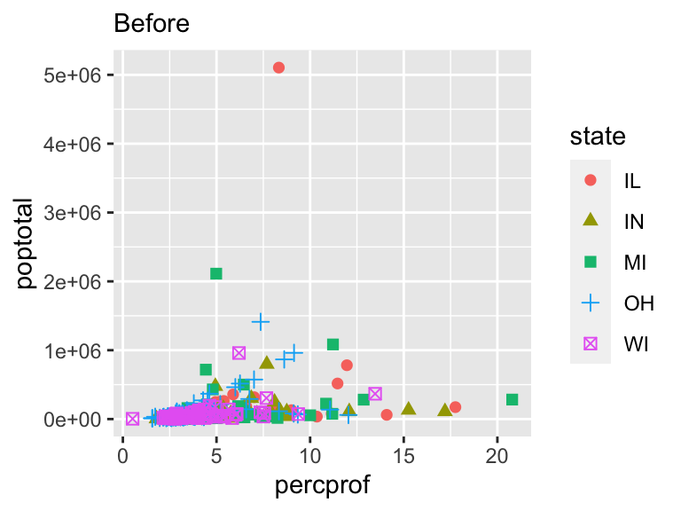
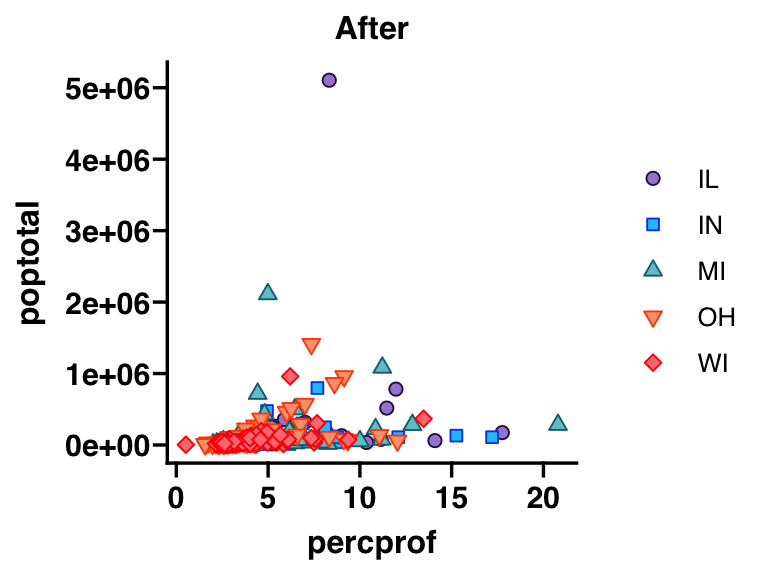
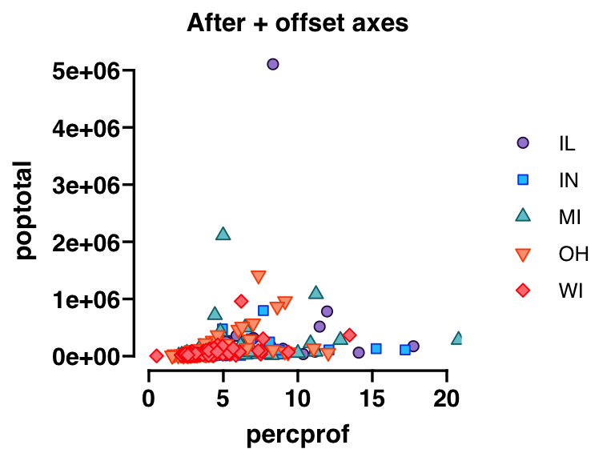
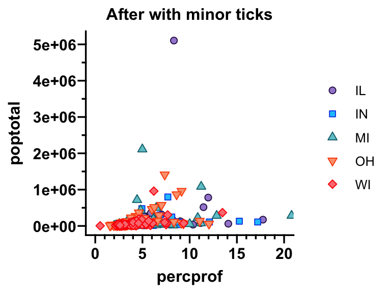
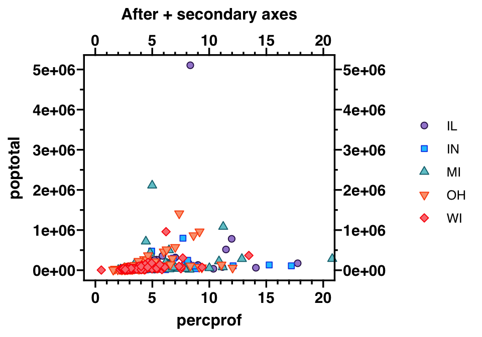

ggprism
================

<!-- README.md is generated from README.Rmd. Please edit that file -->

Prism colour schemes as ggplot2 themes.

This R package is a work in progress and is currently functional, but is
undocumented and untested.

## Install

Install the development version from github.

``` r
library("devtools")
install_github("csdaw/ggprism")
```

## Examples

``` r
library(ggplot2)
library(ggprism)

# Before
p1 <- ggplot(midwest, aes(x=percprof, y=poptotal)) +
  geom_point(aes(shape = state, fill = state, colour = state), size = 2)

p1 + labs(subtitle = "Before")
```



``` r
# After
p2 <- p1 + 
  theme_prism("black_and_white") + 
  scale_shape_prism("filled") + 
  scale_fill_prism("prism_light") + 
  scale_colour_prism("prism_light")

p2 + labs(subtitle = "After")
```



``` r
# After with offset axes
p3 <- p2 + 
  scale_x_continuous(guide = "prism_offset") + 
  scale_y_continuous(guide = "prism_offset")

p3 + labs(subtitle = "After + offset axes") + 
  coord_cartesian(xlim = c(0, 20))
```



``` r
# After with minor ticks
p4 <- p2 + 
  scale_x_continuous(minor_breaks = seq(0, 20, 1), 
                            guide = "prism_minor") + 
  scale_y_continuous(minor_breaks = seq(0, 5e6, 0.5e6), 
                     guide = "prism_minor")

p4 + labs(subtitle = "After + minor ticks") + 
  coord_cartesian(xlim = c(0, 20))
```



``` r
# After with offset axis and minor ticks
p5 <- p2 + 
  scale_x_continuous(guide = "offset_minor") + 
  scale_y_continuous(guide = "offset_minor")

p5 + labs(subtitle = "After + offset minor axes") + 
  coord_cartesian(xlim = c(0, 20))
```


``` r
# After with secondary axes
# (A bit hacky but it works)
p6 <- p2 + 
  scale_x_continuous(minor_breaks = seq(0, 20, 1), 
                            guide = "prism_minor", 
                     sec.axis = sec_axis(~ ., guide = "axis")) + 
  scale_y_continuous(minor_breaks = seq(0, 5e6, 0.5e6), 
                     guide = "prism_minor", 
                     sec.axis = sec_axis(~ ., guide = "axis")) + 
  annotation_ticks(sides = "tr", type = "minor", outside = TRUE)

# Need to turn off clipping for annotations outside the plot area
p6 + labs(subtitle = "After + secondary axes") + 
  coord_cartesian(xlim = c(0, 20), clip = "off")
```


