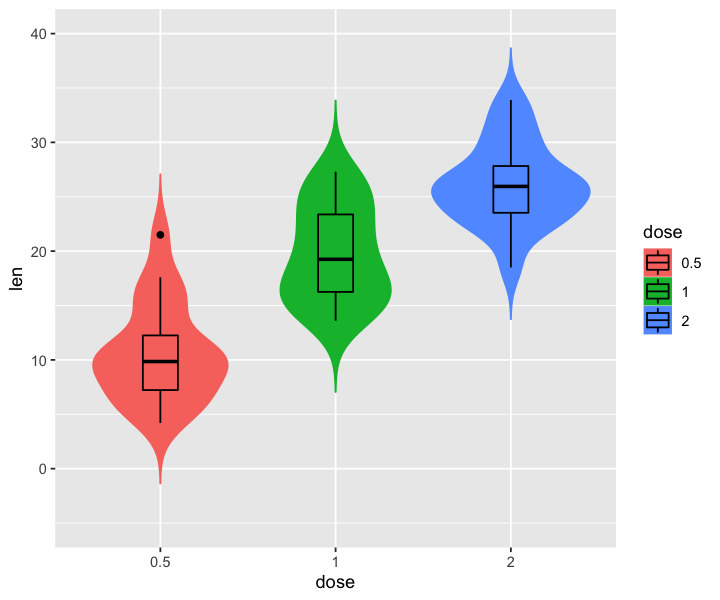
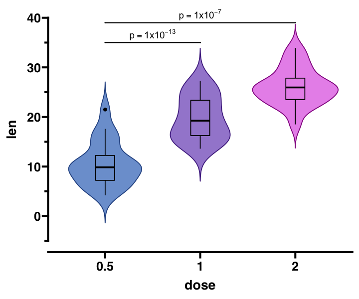
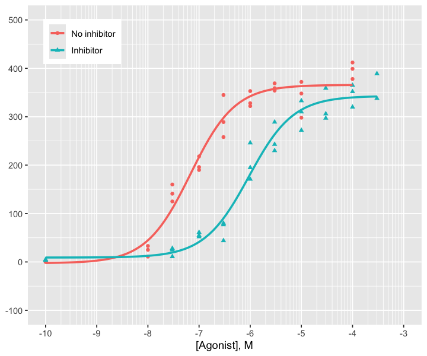
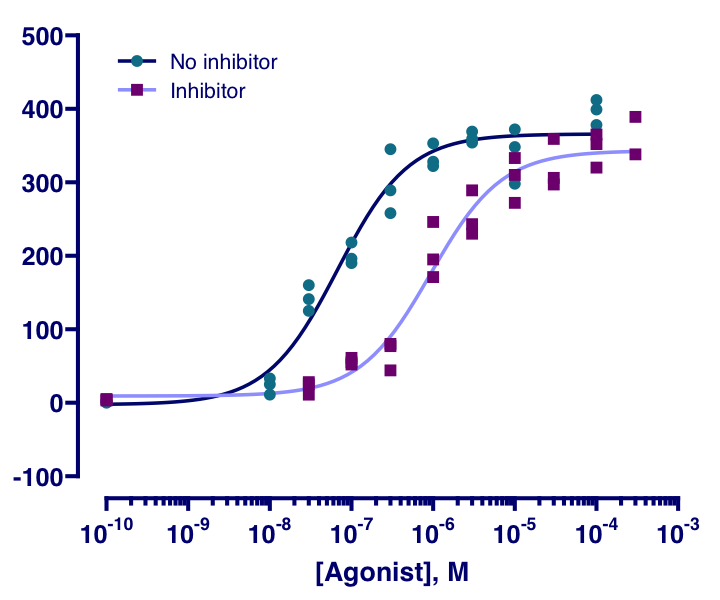
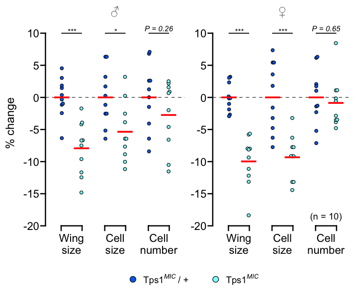

<!-- README.md is generated from README.Rmd. Please edit that file -->

# ggprism 

<!-- badges: start -->

[](https://github.com/csdaw/ggprism/actions)
[](https://codecov.io/gh/csdaw/ggprism?branch=master)
[](https://cran.r-project.org/package=ggprism)
[](https://csdaw.github.io/ggprism/)
<!-- badges: end -->

The `ggprism` package provides various themes, palettes, and other
useful functions to customise ggplots and give them the *‘GraphPad
Prism’* look.

## Install

Install the latest version from CRAN:

``` r
install.packages("ggprism")
```

Install the development version from GitHub:

``` r
remotes::install_github("csdaw/ggprism")
```

## How to Use

See the [Getting
Started](https://csdaw.github.io/ggprism/articles/ggprism.html) page for
a quick overview of `ggprism` features. Detailed examples and
instructions can be found below and on the [`ggprism`
website](https://csdaw.github.io/ggprism/).

``` r
library(ggplot2)
library(ggprism)

tg <- ToothGrowth
tg$dose <- as.factor(tg$dose)

base <- ggplot(tg, aes(x = dose, y = len)) + 
  geom_violin(aes(colour = dose, fill = dose), trim = FALSE) + 
  geom_boxplot(aes(fill = dose), width = 0.2, colour = "black") + 
  scale_y_continuous(limits = c(-5, 40))

p_vals <- tibble::tribble(
  ~group1, ~group2, ~p.adj,   ~y.position,
  "0.5",   "1",     8.80e-14, 35,
  "0.5",   "2",     1.27e-7,  39
)
```

``` r
base

base + 
  scale_color_prism("floral") + 
  scale_fill_prism("floral") + 
  guides(y = "prism_offset_minor") + 
  theme_prism(base_size = 16) + 
  theme(legend.position = "none") + 
  add_pvalue(p_vals, label = "p = {p.adj}", tip.length = 0, label.size = 4)
```



## Feedback and Contributions

Any feedback, questions, and suggestions are welcome and should be
shared via [GitHub
discussions](https://github.com/csdaw/ggprism/discussions).

Bug reports should be submitted via [GitHub
issues](https://github.com/csdaw/ggprism/issues) with a minimal
reproducible example, e.g. using the
[`reprex`](https://reprex.tidyverse.org) package.

Contributions to `ggprism` are also welcome and pull requires should
also be submitted via [GitHub
issues](https://github.com/csdaw/ggprism/issues). Please fork/clone this
repository and **create a new branch** to develop your contribution in.
Some ways to contribute might include:

-   Updates and corrections to documentation
-   Examples and vignettes for existing functions
-   Bug fixes
-   New functions with associated documentation, examples, and tests

## Cite

I would be very grateful if you could cite this package if you use it in
your publication.

Charlotte Dawson (2021), *ggprism: A ggplot2 extension inspired by
GraphPad Prism*. R package version 1.0.1,
<https://csdaw.github.io/ggprism/>.

## More Examples

Recreates [this
figure](https://cdn.graphpad.com/assets/0.27.0/images/srcset/prism-get-actionable-help-w1920-800.png)
from the GraphPad Prism website. See [this
vignette](https://csdaw.github.io/ggprism/articles/ex1-dose.html) for
the source code and step-by-step instructions.



Recreates Figure 2B from [Matsushita & Nishimura
(2020)](https://doi.org/10.1038/s42003-020-0889-1), which was originally
created using GraphPad Prism. See [this
vignette](https://csdaw.github.io/ggprism/articles/ex2-wings.html) for
the source code and step-by-step instructions.


